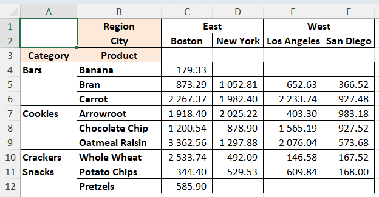
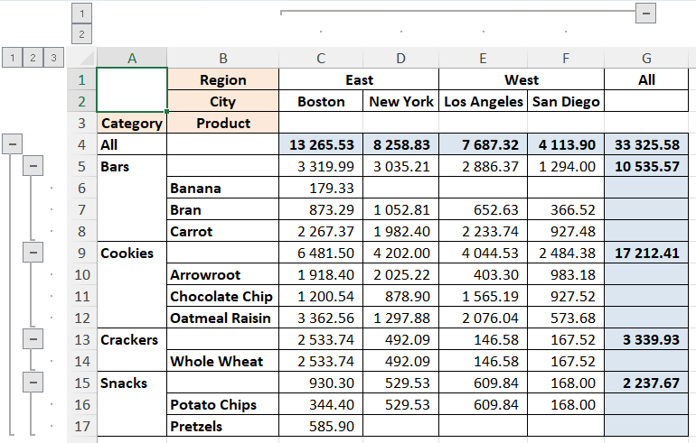
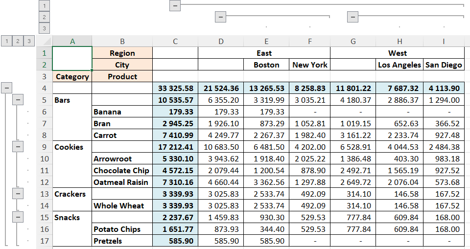

# Pivot table in Python as in Excel

> A pivot table with intermediate and final results both by rows and by columns is already in *Python*.

Pivot tables are an undeniably cool thing for analyzing (summarizing, aggregating) multi-category data. Those who are familiar with them do not need to be convinced of this. Those who do not know, will be happy to receive a "Swiss army knife", which can come in handy in many situations.

Pivot tables are implemented in many environments, platforms, and libraries.

The implementation of pivot tables in Excel can be attributed to the "gold standard". It has a convenient interactive interface, including filters. A very important feature is the presence, in addition to aggregation, of intermediate and final summaries both by rows and by columns.

## Problem

Everything seems to be fine. So, this is where I could end my story. But there is always a need for more. In this case, we need automation of the building the pivot table, without manual work, directly in the program code. And here we turn to the implementation of pivot tables in *Python*.

Perhaps the most widely known method in *Python* is `pivot_table` from the package `Pandas`. But there is one "but" - this method aggregates without creating intermediate and final summaries both by rows and columns.

For example, let's demonstrate this statement on the open test data set [sampledatafoodsales](https://www.scribd.com/document/633622920/sampledatafoodsales-xlsx) . I will not describe this dataset, it's quite simple - let's go straight to the example. In Python terms, building this example pivot table would look like this:

```python
''' Standard Pivot '''
pt0 = pd.pivot_table(df, 
                     values='TotalPrice',
                     index=['Category', 'Product'],
                     columns=['Region', 'City'], 
                     aggfunc=np.nansum)
```

In principle, the example is self-evident - we build the distribution of sales `TotalPrice` of products `Product` grouped by categories `Category` in cities `City` grouped by regions `Region`.

And now let's compare what the result looks like in *Python* and in *Excel*.


Figure 1. Excel pivot table.



Figure 2. Standard *Pandas* *Python* pivot table. The result is imported into and displayed in *Excel*.

We see a numerically identical result, except that the pivot table in Excel additionally contains intermediate and total sums by regions `Region` (columns) and by categories `Category` (rows).

We will deal with the actual solution of this issue in *Python* below.

## Available other solutions

Found quick solutions like [pivottablejs](https://github.com/nicolaskruchten/jupyter_pivottablejs) and [mito](https://www.trymito.io/) didn't give the desired result.

Will Keefe's solution, described in the article " [Tabulating Subtotals Dynamically in Python Pandas Pivot Tables](https://medium.com/p/6efadbb79be2) ", turned out to be much closer to the desired result.

But this solution has its limitations. A pivot table built using the Will Keefe's method creates subtotals and grand totals by row only. Let's see how our example of a pivot table will look with this method (the name of the function here is somewhat shortened compared to the original):

```python
''' Will Keefe's Pivot '''
pt1 = pivot_w_subtot(df=df, 
                     values='TotalPrice', 
                     indices=['Category', 'Product'], 
                     columns=['Region', 'City'], 
                     aggfunc=np.nansum, 
                     margins=True)
```

The actual pivot table will look like this:



Figure 3. Python pivot table by Will Keefe. The result is imported into and displayed in Excel.

As you can see, the generalization by lines comes up as it should - there is aggregation by individual categories `Bars`, `Cookies`, `Crackers`, `Snacks` and also by all categories `All`.

At the same time, there are no summaries for individual regions (columns) `East` and `West`, and there are also no total summaries in the rows of specific products.

## Solution

Let's try to develop Will Keefe's method `pivot_w_subtot`, adding to it the ability to build summaries by columns by categories of higher levels.

To do this, we call `pivot_w_subtot` with an argument value of `margins=False`. In this case, only the column  `All` and row  `All` will disappear in the resulting pivot table. Everything else remains in place.

Then to obtain total summaries vertically and horizontally only at the top level, we create two new temporary columns in the input dataframe `df_long`:

```python
df_long = df.copy()

df_long['All_cols'] = 0 # For the summary by columns at uppermost level
df_long['All_rows'] = 0 # For the summary by rows at uppermost level
```

First, we create a vertical summary, that is, for all rows, including the total summary of the top level of the input table `df_long`, thanks to the inclusion of the column `All_cols`and the corresponding index:

```python
df_wide = pivot_w_subtot(df=df_long, values=values, 
                         indices=['All_rows',] + indices, 
                         columns=['All_cols',] + columns, 
                         aggfunc=np.nansum, 
                         fill_value=np.nan)
```

Then we stretch the "wide" table `df_wide` again into a "long" one `df_long`, but this time it contains the summaries of all levels of the vertical hierarchy:

```python
df_long = pd.melt(df_wide, 
                  value_name='value', 
                  ignore_index=False).reset_index()
```

Now we create a summary from a long table `df_long` horizontally (that is, on all columns), but placing them vertically. This is achieved by assigning all the columns to the argument `indices` and, conversely, all the rows to the argument `columns`. And, at the end, we transpose (.T) the resulting table, that is, we change the rows (`axis=0`) and columns (`axis=1`):

```python
df_wide = pivot_w_subtot(df=df_long, 
                         values='value', 
                         columns=['All_rows',] + indices, 
                         indices=['All_cols',] + columns, 
                         aggfunc=np.nansum, 
                         fill_value=np.nan).T
```

And, finally, we change the vertical and horizontal indices, for this we cut off the temporary highest levels in them - `All_cols` and `All_rows`:

```python
    df_wide.index = df_wide.index.droplevel(0)
    df_wide.columns = df_wide.columns.droplevel(0)
```

That's all. Now the pivot table will look like this:



Figure 4. Python pivot table by @oleghbond. The result is imported into and displayed in Excel.

## Conclusions

A pivot table with intermediate and final results both by rows and by columns is already in Python. The complete code of the method with a test example can be found on *github* – .

The presented method is not interactive, but it is not required. Instead, the result is obtained programmatically in the form of a standard multi-index data frame.

And the last. The methods on which the presented method is built, namely: `python_table`and `pivot_w_subtot`do not lose their value when summarization without subtotals or with subtotals only by rows is required.

## Ukrainian version
