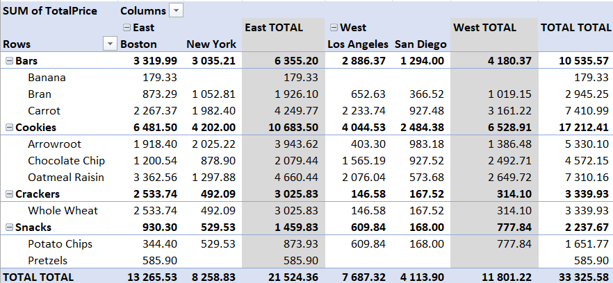
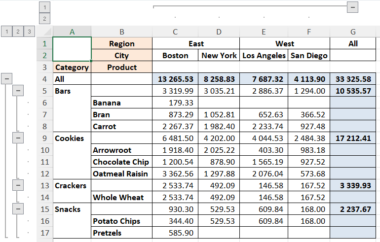
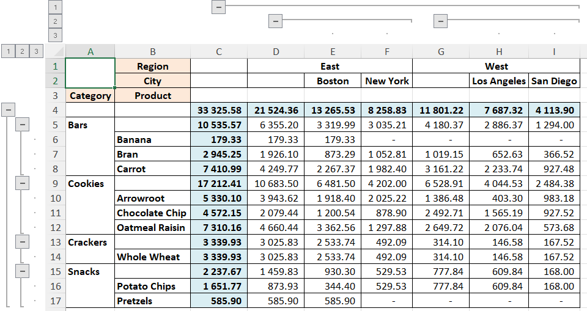

# Зведена таблиця в Python як в Excel

> Зведена таблиця з проміжними і кінцевими підсумками як за рядками, так і за колонками вже у Python.

Зведені таблиці – беззаперечно класна штука для аналіза (узагальнення, агрегації) багатокатегоріальних даних. Хто знайомий з ними, ті не потребують, щоб їх переконували у цьому. Хто не знає, зрадіють, отримавши "швейцарській ніж", що може статися в нагоді у багатьох ситуаціях.

Зведені таблиці реалізовані у багатьох середовищах, платформах і бібліотеках.

До "золотого стандарту" можна віднести реалізацію зведених таблиць у Екселі. Вона має зручний інтерактивний інтерфейс, включно з фільтрами. Дуже важливою особливістю є наявність, окрім агрегації, проміжних і кінцевих підсумків як за рядками, так і за колонками.

## Проблема

Все начебто добре. На цьому можна було б завершити. Але завжди виникає потреба більшого. В даному випадку нам потрібна автоматизація побудови зведеної таблиці, без ручної роботи, безпосередньо в програмному коді. І тут ми звертаємось до реалізації зведених таблиць у Python.

Мабуть найпоширеніше відомий метод в Python це `pivot_table` з пакету `Pandas`. Але є одне "але" – цей метод агрегує без створення проміжних і кінцевих підсумків як за рядками і колонками.

Для прикладу продемонструємо це твердження на відкритому тестовому наборі даних [sampledatafoodsales](https://www.scribd.com/document/633622920/sampledatafoodsales-xlsx). Не буду описувати цей набір – перейдемо одразу до прикладу. В термінах Python побудова цього прикладу зведеної таблиці виглядатиме так:

```python
''' Standard Pivot '''
pt0 = pd.pivot_table(df, 
                     values='TotalPrice',
                     index=['Category', 'Product'],
                     columns=['Region', 'City'], 
                     aggfunc=np.nansum)
```

В принципі приклад самоочевидний – будуємо розподіл продажів `TotalPrice` продуктів `Product`, згрупованих за категоріями `Category`, в містах `City`, що згруповані за регіонами `Region`.

А  тепер порівняємо як виглядає результат у Python і в Екселі.



Рисунок 1. Зведена таблиця Excel.


Рисунок 2. Стандартна зведена таблиця Pandas Python. Результат імпортовано і відображено в Excel.

Ми бачимо чисельно ідентичний результат за виключенням того, що у зведеній таблиці в Екселі додатково є проміжні і загальні підсумки за регіонами  `Region` (стовпчики) і за категоріями `Category` (рядки).

Власне вирішенням цього питання у Python ми займемося нижче.

## Наявні рішення

Знайдені нашвидкоруч готові рішення, такі як [pivottablejs](https://github.com/nicolaskruchten/jupyter_pivottablejs) та [mito](https://www.trymito.io/), не дали потрібного результату.

Набагато ближчим до бажаного результату виявилось рішення Will Keefe, що описано у статті "[Tabulating Subtotals Dynamically in Python Pandas Pivot Tables](https://medium.com/p/6efadbb79be2)". 

Але у цього рішення є своя обмеженість. Зведена таблиця, побудована з допомогою метода Will Keefe, створює проміжні і загальні підсумки лише за рядками. Подивимось, як виглядатиме наш приклад зведеної таблиці із цим методом (назва фунції тут дещо скорочена у порівнянні з оригіналом):

 ```python
''' Will Keefe's Pivot '''
pt1 = pivot_w_subtot(df=df, 
                     values='TotalPrice', 
                     indices=['Category', 'Product'], 
                     columns=['Region', 'City'], 
                     aggfunc=np.nansum, 
                     margins=True)
 ```

Власне таблиця виглядатиме таким чином:



Рисунок 3. Зведена таблиця в *Python* від Will Keefe. Результат імпортовано і відображено в Excel.

Як бачимо, узагальнення за рядками вигядає, як належить – є агрегація за окремими категоріями `Bars`, `Cookies`, `Crackers`, `Snacks` і також за всіма категоріями `All`.

Водночас, відсутні підсумки за окремими регіонами (стовпчиками) `East` і `West`, і також відсутні загальні підсумки в рядках конкретних продуктів. 

## Рішення

Спробуємо розвинути метод Will Keefe `pivot_w_subtot`, додавши йому спроможність будувати підсумки за стовпцями за категоріями вищих рівнів.

Для цього ми використаємо виклик метода `pivot_w_subtot` зі значенням аргументу `margins=False`. В такому разі у результуючій зведеній таблиці зникнуть лише стовпчик і рядок `All`. Все решта залишається на місці.

Потім, для отримання загальних підсумків по вертикалі і горизонталі лише на найверхньому рівні створюємо два нові тимчасові стовпчики у датафрейм вхідних даних `df_long`:

```python
df_long = df.copy()

df_long['All_cols'] = 0 # For the summary by columns at uppermost level
df_long['All_rows'] = 0 # For the summary by rows at uppermost level
```

 Спочатку ми створюємо вертикальний підсумок, тобто для всіх рядків, включаючи загальний підсумок верхнього рівня вхідної таблиці `df_long`, завдяки включенню стовпця `All_cols` і відповідного індексу:

```python
df_wide = pivot_w_subtot(df=df_long, values=values, 
                         indices=['All_rows',] + indices, 
                         columns=['All_cols',] + columns, 
                         aggfunc=np.nansum, 
                         fill_value=np.nan)
```

Розгортаємо "широку" таблицю `df_wide` знов у "довгу" `df_long`, але цього разу вона містить підсумки всіх рівнів ієрархії по вертикалі:

```python
df_long = pd.melt(df_wide, 
                  value_name='value', 
                  ignore_index=False).reset_index()
```

Тепер з довгої таблиці `df_long` створюємо зведення по горизонталі (тобто по всіх стовпцях), але розташовуючи їх вертикально. Це досягається шляхом призначення всіх стовпців аргументу `indices` і, навпаки, усіх рядків аргументу `columns`. І, наприкінці, ми транспонуємо (.T) отриману таблицю, тобто змінюємо рядки (axis=0) і стовпці (axis=1):

```python
df_wide = pivot_w_subtot(df=df_long, 
                         values='value', 
                         columns=['All_rows',] + indices, 
                         indices=['All_cols',] + columns, 
                         aggfunc=np.nansum, 
                         fill_value=np.nan).T
```

І, нарешті, ми змінюємо вертикальні та горизонтальні індекси, для цього обрізаємо в них тимчасові найвищі рівні - `All_cols` і `All_rows`:

```python
    df_wide.index = df_wide.index.droplevel(0)
    df_wide.columns = df_wide.columns.droplevel(0)
```

Це все. Тепер зведена таблиця виглядатиме так:



Рисунок 4. Зведена таблиця в *Python* від @oleghbond. Результат імпортовано і відображено в Excel.

## Висновки

Зведена таблиця з проміжними і кінцевими підсумками як за рядками, так і за колонками вже у Python. Повний код метода з тестовим прикладом можна знайти на *github*.

Представлений метод не інтерактивний, але це і не вимагається. Натомість результат отриманий програмним шляхом у вигляді стандартного мультііндексного датафрейма.

І, останнє. Методи, на яких побудований представлений метод, а саме: `python_table` і `pivot_w_subtot` не втрачають свого значення, коли потрібне зведення без проміжних підсумків або з проміжними підсумками лише за рядками.

## Англомовна версія
